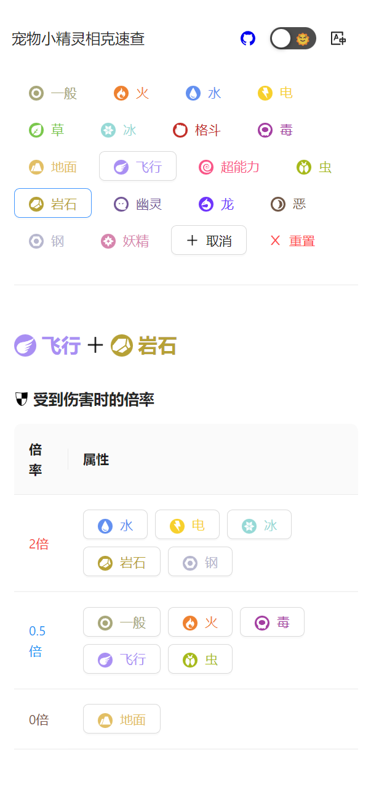

# pokemon-weakness

Yet another Pokémon Weakness Explorer

[Demo](https://weakness-explorer.web.app/)

### :star2: Features

- Add as many types as you like
- Supports EN/FR/JA/CHS languages
- PWA ready

### :framed_picture: Gallery

### :information_source: Credits

[PokeAPI](https://pokeapi.co/)

[Pokemon Type SVG Icons](https://github.com/duiker101/pokemon-type-svg-icons)

[Service Worker Example](https://googlechrome.github.io/samples/service-worker/basic/)
